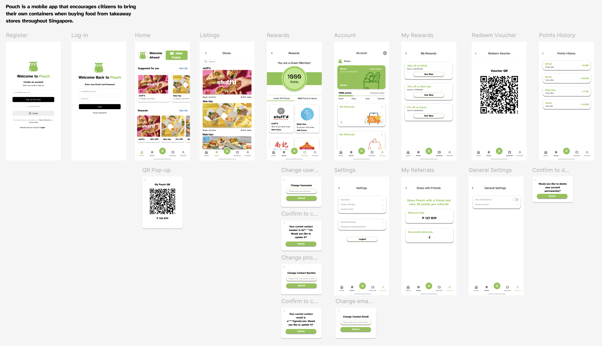

# Pouch

Our team built Pouch for Brainhack CODE_Exp 2024 and won Runner-Up in the Human-Centric category.

## Description

Pouch is an app designed to encourage and reward consumers for making environmentally conscious choices, while aiming to reduce the usage of single-use plastics that contribute to climate change.

Through Pouch, consumers are able to accumulate points when using reusables for takeaways and translate them into tangible rewards. From exclusive discounts to cashbacks, these incentives are meant to make sustainability rewarding and fun.

Pouch features a user-friendly interface where users can track their accumulated points, find participating outlets and discover available rewards. Integrating seamlessly into daily routines, your journey to a more sustainable lifestyle is just a tap away.

## Wireframe

## Set Up

1. Install Expo CLI

       npm install -g expo-cli

2. Create react native app and select the blank template

       expo init frontend

3. Change directory into `frontend` and run the app. Scan the QR code to launch it on Expo Go or your respective simulators.

       cd frontend
       npm start

## Contributors

- [Rachel Tan](https://github.com/Racheltmz)
- [Gwendalene Ionna](https://github.com/gwenionna)
- [Sanjana Shanmugasundaram](https://github.com/snnjana)
